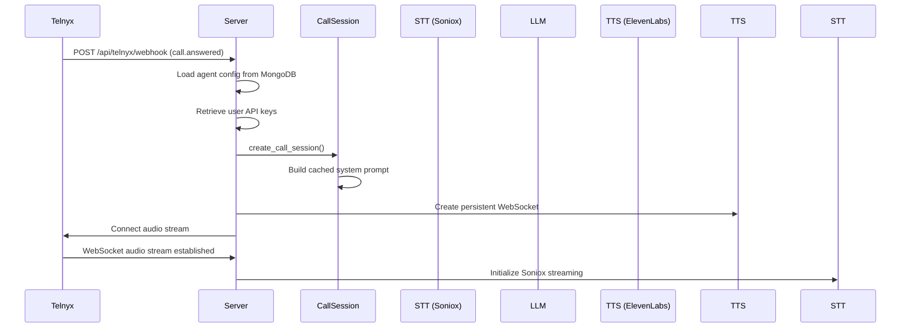
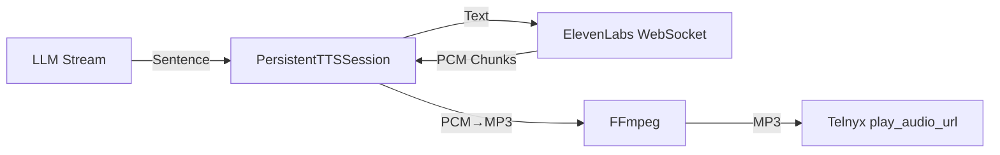

# Comprehensive Call Feature Documentation

This document provides a complete technical breakdown of the AI voice calling system, covering call flow architecture, node types, live call mechanics, streaming, interruption handling, and latency optimization.

---

## Table of Contents

1. [Call Flow Architecture](#1-call-flow-architecture)
2. [Node Types & Functionality](#2-node-types--functionality)
3. [Live Call Mechanics](#3-live-call-mechanics)
4. [Interruption Handling](#4-interruption-handling)
5. [End Nodes & Call Termination](#5-end-nodes--call-termination)
6. [Webhook System](#6-webhook-system)
7. [Audio Streaming Pipeline](#7-audio-streaming-pipeline)
8. [Latency Optimization](#8-latency-optimization)

---

## 1. Call Flow Architecture

### 1.1 How a Call Starts

**Files:** `server.py`, `calling_service.py`



**Initialization Steps:**

1. **Webhook Received** (`server.py:telnyx_webhook`): Telnyx sends `call.answered` event
2. **Agent Config Loaded**: Fetched from MongoDB with user-specific settings
3. **API Keys Retrieved**: User's keys for Soniox, ElevenLabs, OpenAI/Grok
4. **CallSession Created** (`calling_service.py:CallSession.__init__`):
   - Initializes conversation history
   - Sets up session variables (including `{{now}}` timestamp)
   - Builds cached system prompt with global prompt + technical rules
   - Initializes voicemail detector
5. **Persistent TTS WebSocket** (`persistent_tts_service.py`): Pre-connects to ElevenLabs for low-latency streaming
6. **Audio Stream**: Telnyx WebSocket established for bi-directional audio

### 1.2 The Beginning Node (Start Node)

**Location:** `calling_service.py:_process_call_flow_streaming()` (lines 921-1110)

The **Start Node** (`type: "start"`) controls call initialization:

```python
# Key fields in start node data:
{
    "whoSpeaksFirst": "ai" | "user",  # Who initiates conversation
    "initialMessage": "...",           # AI's opening if it speaks first
    "transitions": [...]               # Routes to first conversation node
}
```

**Who Speaks First Logic:**

| Setting | Behavior |
|---------|----------|
| `"ai"` | Agent speaks first using `initialMessage`, then waits for user |
| `"user"` | System waits for user to speak, triggers on first utterance |

**Code Path (lines 986-1011):**
```python
if who_speaks_first == "ai":
    # Find first conversation node and speak its content
    for node in flow_nodes:
        if node.get("type") == "conversation":
            selected_node = node
            break
else:
    # Wait for user input, then find matching node
    selected_node = await self._get_first_conversation_node(flow_nodes)
```

---

## 2. Node Types & Functionality

### 2.1 Conversation Node

**The primary interactive node type.** Handles AI-generated or scripted responses.

**Key Fields:**
```python
{
    "type": "conversation",
    "data": {
        "label": "Node Name",
        "mode": "script" | "prompt",      # Script = exact text, Prompt = AI-generated
        "script": "...",                   # Text for script mode
        "content": "...",                  # Instructions for prompt mode
        "goal": "...",                     # Objective for AI to achieve
        "extract_variables": [...],        # Variables to extract from user
        "transitions": [...],              # Conditions for moving to next node
        "skip_mandatory_precheck": false,  # For Q&A nodes
        "auto_transition_to": "node_id",   # Skip LLM evaluation
        "auto_transition_after_response": "node_id"  # Transition after user speaks
    }
}
```

**Mode Differences:**

| Mode | Behavior | Latency |
|------|----------|---------|
| `script` | Returns exact text instantly | ~10ms |
| `prompt` | Calls LLM to generate response | 500-2000ms |

**Code Location:** `calling_service.py:_process_call_flow_streaming()` (lines 1431-1460)

### 2.2 Function/Webhook Node

**Executes HTTP webhooks with variable substitution.**

**Key Fields:**
```python
{
    "type": "function",
    "data": {
        "webhook_url": "https://...",
        "webhook_method": "POST",
        "webhook_body": "{...}",           # JSON with {{variables}}
        "webhook_headers": {...},
        "webhook_timeout": 10,
        "response_variable": "webhook_response",
        "speak_during_execution": true,    # Speak while webhook runs
        "dialogue_text": "...",            # What to say during webhook
        "wait_for_result": true,           # Block until webhook completes
        "transitions": [...]               # Evaluated on webhook response
    }
}
```

**Execution Flow:**

1. **Pre-Webhook Dialogue** (optional): Speak to user while webhook runs
2. **Variable Substitution**: Replace `{{var}}` placeholders with session values
3. **Execute Webhook**: POST/GET to configured URL
4. **Store Response**: Save in `session_variables[response_variable]`
5. **Evaluate Transitions**: Based on webhook response (not user message)

**Code Location:** `calling_service.py:_execute_webhook()` (lines 2836-3285)

### 2.3 Ending Node

**Terminates the call gracefully.**

```python
{
    "type": "ending",
    "data": {
        "content": "Thank you for calling. Goodbye!",
        "transitions": []  # No outgoing transitions
    }
}
```

**Behavior:**
1. Sets `session.should_end_call = True`
2. Speaks the ending content
3. Waits for audio to complete (~3.5 seconds)
4. Calls `telnyx_service.hangup_call()`
5. Cleans up Redis and in-memory state

**Code:** `calling_service.py` line 1254-1257, `server.py` hangup logic

### 2.4 Other Node Types

| Node Type | Purpose | Handler Method |
|-----------|---------|----------------|
| `collect_input` | Validate specific input format (email, phone, etc.) | `_handle_collect_input()` |
| `press_digit` | DTMF digit routing | `_handle_press_digit()` |
| `extract_variable` | AI-powered variable extraction | `_handle_extract_variable()` |
| `logic_split` | Conditional branching based on variables | `_evaluate_logic_conditions()` |
| `send_sms` | Send SMS via Telnyx | `_handle_send_sms()` |
| `call_transfer` | Transfer to another number | `_handle_transfer()` |

---

## 3. Live Call Mechanics

### 3.1 Transitions

**File:** `calling_service.py:_follow_transition()` (lines 2023-2331)

Transitions determine how the conversation flows between nodes.

**Transition Structure:**
```python
{
    "condition": "User confirms they want to proceed",  # Natural language
    "nextNode": "node_uuid",
    "check_variables": ["customer_name"]  # Required variables to take this path
}
```

**Evaluation Process:**

1. **Variable Checks**: Verify required variables exist in session
2. **Auto-Transition Check**: If `auto_transition_after_response` set, skip LLM
3. **LLM Evaluation**: 
   - For conversation nodes: Evaluate user message against conditions
   - For function nodes: Evaluate webhook response against conditions
4. **1.5s Timeout**: Prevents LLM freezes from blocking call
5. **Fallback**: If no match and node has goal, stay on current node

**Key Optimizations:**
```python
# Aggressive timeout to prevent freezes (line 2250)
response = await asyncio.wait_for(call_llm_for_transition(), timeout=1.5)

# Variable gate - skip transition if variables missing (lines 2079-2090)
if check_variables:
    for var_name in check_variables:
        if var_name not in self.session_variables:
            continue  # Skip this transition
```

### 3.2 Goals

**Node goals guide AI responses when user doesn't match any transition.**

```python
"goal": "Get the customer to confirm their monthly income is over $10,000"
```

When transitions return `-1` (no match), the system checks for a goal and stays on the current node, allowing the AI to guide the user toward satisfying a condition.

**Code:** lines 2298-2313

### 3.3 Variables

**Types of Variables:**

| Variable Type | Storage | Example |
|--------------|---------|---------|
| Session Variables | `session.session_variables` | `customer_name`, `phone_number` |
| Webhook Response | `session_variables["webhook_response"]` | Full webhook JSON |
| System Variables | Auto-populated | `{{now}}` = current EST timestamp |

**Variable Extraction:**

Two modes:
1. **Real-time** (`_extract_variables_realtime`): Before generating response, blocks if mandatory missing
2. **Background** (`_extract_variables_background`): After response, non-blocking for optional variables

**Mandatory Variable Flow:**
```python
# PRE-RESPONSE check (line 1404-1422)
if has_mandatory:
    extraction_result = await self._extract_variables_realtime(...)
    if not extraction_result.get("success"):
        # Return reprompt instead of normal response
        return reprompt
```

---

## 4. Interruption Handling

### 4.1 Core Mechanic

**File:** `server.py:on_partial_transcript()` in `handle_soniox_streaming()`

The system detects user interruptions during agent speech via partial transcripts.

**Interruption Detection Logic:**

```python
# Trigger conditions:
if agent_generating_response and partial_transcript.strip():
    word_count = len(partial_transcript.strip().split())
    
    # Must be 2+ words AND not an echo
    if word_count >= 2 and not is_echo:
        # INTERRUPT! Stop all playbacks
```

### 4.2 Ignoring Affirmative Statements

**Problem:** Users say "yeah", "okay", "mhm" during agent speech - these shouldn't interrupt.

**Solution (server.py):**

```python
# Single-word acknowledgments during agent speech are ignored
if word_count < 2:
    # Ignore 1-word acknowledgments like "yeah", "okay"
    return
```

**Post-Processing for Check-ins:**
```python
# calling_service.py lines 624-646
acknowledgment_words = ['yeah', 'yes', 'okay', 'ok', 'yep', 'sure', 'uh-huh', 'mhm']
user_words = user_text.lower().strip().split()
is_acknowledgment = (
    len(user_words) <= 2 and 
    any(word in acknowledgment_words for word in user_words)
)
```

### 4.3 Echo Filtering

**Problem:** Speakerphone users cause the agent's own voice to be transcribed.

**Solution (server.py echo filter):**

```python
# Echo detection uses 3 methods:
# 1. Word similarity (30% threshold)
similarity = len(common_words) / len(agent_words)

# 2. Substring match
transcript_in_agent = transcript_normalized in agent_normalized

# 3. Trigram phrase match
for i in range(len(words_list) - 2):
    trigram = ' '.join(words_list[i:i+3])
    if trigram in agent_normalized:
        is_echo = True
```

### 4.4 When Interruptions ARE Allowed

Interruptions trigger when:
- User says **2+ words** during agent speech
- Words are **not an echo** of recent agent text
- User is **not giving an acknowledgment**

**Response to Interruption:**
1. Stop all active Telnyx playbacks (except comfort noise)
2. Clear `agent_generating_response` flag
3. Wait 0.4s (human reaction time simulation)
4. Process user's full utterance normally

---

## 5. End Nodes & Call Termination

### 5.1 End Node Mechanics

**File:** `calling_service.py` lines 1253-1257

```python
if node_type == "ending":
    logger.info("🛑 Ending node reached - call should terminate")
    self.should_end_call = True
```

### 5.2 Call Termination Flow

**File:** `server.py` - multiple locations check `should_end_call`

```python
if session.should_end_call or session.should_end_call_max_checkins() or session.should_end_call_max_duration():
    call_ending = True
    
    logger.info("📞 Ending call now - waiting for goodbye audio to complete...")
    await asyncio.sleep(3.5)  # Wait for audio
    
    result = await telnyx_svc.hangup_call(call_control_id)
```

### 5.3 Other Termination Triggers

| Trigger | Method | Description |
|---------|--------|-------------|
| Ending node | `should_end_call = True` | Normal flow completion |
| Max check-ins | `should_end_call_max_checkins()` | Dead air timeout after 2 check-ins |
| Max duration | `should_end_call_max_duration()` | 25-minute call limit |
| Voicemail detected | `voicemail_detector.analyze_transcript()` | Auto-disconnect on voicemail |

---

## 6. Webhook System

### 6.1 Call-Started Webhook

**File:** `server.py:telnyx_webhook()` inner function `send_call_started_webhook()`

Fires when call connects, sends:
```json
{
    "event": "call_started",
    "call_id": "...",
    "agent_id": "...",
    "from_number": "+1...",
    "to_number": "+1...",
    "direction": "inbound|outbound",
    "timestamp": "..."
}
```

### 6.2 Post-Call Webhook

**File:** `server.py:finalize_call_log()` inner function `send_webhook()`

Fires after call ends, sends complete call data:
```json
{
    "event": "call_ended",
    "call_id": "...",
    "transcript": [...],
    "duration": 180,
    "status": "completed",
    "extracted_variables": {...},
    "recording_url": "..."
}
```

### 6.3 Function Node Webhooks

**File:** `calling_service.py:_execute_webhook()` (lines 2836-3285)

In-call webhooks with variable substitution:

1. **Build payload** with `{{variable}}` replacement
2. **Execute HTTP request** with timeout
3. **Parse response** and store in `session_variables`
4. **Extract variables** from response if configured
5. **Evaluate transitions** based on response

---

## 7. Audio Streaming Pipeline

### 7.1 TTS Streaming Architecture

**File:** `persistent_tts_service.py`



### 7.2 Dual-Stream Architecture

**File:** `natural_delivery_middleware.py`

The Natural Delivery Middleware provides two output streams:

1. **Logic Stream**: Clean text for history and variable extraction
2. **Audio Stream**: Text with SSML/voice settings for TTS

**Emotion Tags:**
```python
# LLM outputs tags like [H], [S], [N]
"[H] Great! I can help with that."  # Happy
"[S] I understand, let's reset."     # Serious  
"[N] The price is $99 per month."    # Neutral
```

**Voice Settings by Emotion:**
```python
EMOTION_MAP = {
    "H": {"stability": 0.30, "style": 0.75},  # Happy: expressive
    "S": {"stability": 0.50, "style": 0.30},  # Serious: grounded
    "N": {"stability": 0.40, "style": 0.20}   # Neutral: engaged
}
```

### 7.3 Sentence-by-Sentence Streaming

**File:** `calling_service.py:stream_callback`, `persistent_tts_service.py:stream_sentence()`

```python
# Stream callback triggered per sentence (lines 1441-1456)
async def stream_sentence_to_tts(sentence):
    if persistent_tts_session:
        await persistent_tts_session.stream_sentence(
            sentence, 
            is_first=is_first, 
            is_last=is_last
        )
```

**Benefits:**
- First sentence plays while LLM generates rest
- Reduces perceived latency by 500-1500ms
- Enables interruption mid-response

---

## 8. Latency Optimization

### 8.1 Latency Components

| Component | Target | Typical | Bottleneck |
|-----------|--------|---------|------------|
| STT Endpoint Detection | 300ms | 600-800ms | Soniox silence detection |
| LLM TTFT | 200-500ms | 500-1000ms | Model/context size |
| Transition Evaluation | 0-200ms | 500-1500ms | LLM call |
| TTS TTFB (WebSocket) | 150-250ms | 200-300ms | ElevenLabs processing |
| Audio Playback Start | 100-200ms | 150-200ms | FFmpeg + Telnyx |

### 8.2 Key Optimizations

**1. Persistent TTS WebSocket**
- Connection stays open for entire call
- Eliminates 800-1500ms REST API overhead per request

**2. Script Mode for Static Content**
- Bypasses LLM entirely (~10ms vs 1000ms)
- Use for greetings, confirmations, goodbyes

**3. Auto-Transitions**
```python
"auto_transition_to": "next_node_id"  # Skip LLM evaluation
"auto_transition_after_response": "next_node_id"  # Transition after user speaks
```

**4. Transition Timeout**
```python
# 1.5s timeout prevents freezes (line 2250)
response = await asyncio.wait_for(call_llm_for_transition(), timeout=1.5)
```

**5. Background Variable Extraction**
```python
# Non-mandatory variables extracted in background
asyncio.create_task(self._extract_variables_background(...))
```

**6. Cached System Prompt**
- Built once at session start
- Enables Grok's prefix caching for faster TTFT

### 8.3 Dead Air Prevention

**File:** `dead_air_monitor.py`, `calling_service.py`

Monitors silence and sends check-in messages:

```python
# Configurable settings in agent config
dead_air_settings = {
    "silence_timeout_normal": 7,      # Seconds before check-in
    "silence_timeout_hold_on": 25,    # Extended if user says "hold on"
    "max_checkins_before_disconnect": 2,
    "checkin_message": "Are you still there?"
}
```

---

## 9. Post-Call Quality Control & Integrations

### 9.1 Auto-QC System
**File:** `qc_agents/orchestrator.py`

Immediately after call termination, a multi-agent Quality Control system analyzes the transcript:

1.  **Commitment Detector**: Scores user intent and commitment (0-100).
2.  **Conversion Pathfinder**: Analyzes the effectiveness of the conversation path.
3.  **Excellence Replicator**: Compares agent performance against "excellence" benchmarks.

**Log Signature:**
```
INFO - 🔍 [AUTO-QC] Running full QC analysis...
INFO - ⭐ Running Excellence Replicator on call...
INFO - 📊 Scores: Commitment=50, Conversion=100, Excellence=50
```

### 9.2 CRM Synchronization
**File:** `server.py` (via `finalize_call_log`)

Results are synced to the external CRM system:
*   **Lead Status Update**: E.g., setting status to 'contacted'.
*   **Risk Assessment**: Updates lead risk level based on QC scores.
*   **Analytics**: Pushes QC scores to campaign dashboards.

---

## Key Files Reference

| File | Purpose |
|------|---------|
| `server.py` | Main API, Telnyx webhooks, audio stream handling |
| `calling_service.py` | CallSession class, node processing, transitions |
| `persistent_tts_service.py` | ElevenLabs WebSocket management, streaming |
| `natural_delivery_middleware.py` | Emotion tags, voice settings |
| `interruption_system.py` | Rambler detection (advanced) |
| `soniox_service.py` | Speech-to-text streaming |
| `telnyx_service.py` | Telnyx API wrapper (play, hangup, transfer) |
| `dead_air_monitor.py` | Silence detection and check-ins |
| `voicemail_detector.py` | Voicemail/IVR detection |

---

## Summary

The call system operates as a state machine where:

1. **Start Node** initializes the call and determines who speaks first
2. **Conversation Nodes** handle the interactive dialogue (script or AI-generated)
3. **Function Nodes** execute webhooks for external integrations
4. **Transitions** use LLM to evaluate user responses against conditions
5. **Interruption handling** allows natural back-and-forth by detecting real interruptions while ignoring acknowledgments and echoes
6. **End Nodes** gracefully terminate calls after speaking goodbye messages
7. **Streaming TTS** maintains low perceived latency by playing audio sentence-by-sentence
8. **Webhooks** notify external systems at call start, during calls (function nodes), and at call end
