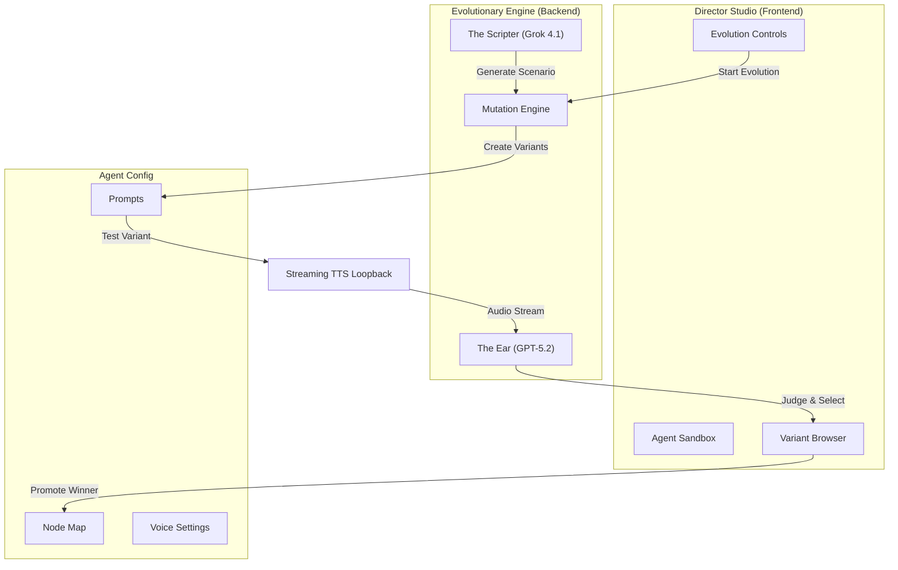

# Feature: Director Mode (Automated Evolutionary Optimization)

## Goal
Replace the manual "tweak, test, listen, rewrite" loop with an **Automated Evolutionary Engine** that evolves the agent's behavior to perfection.

## Core Concept: "Survival of the Fittest Node"
We move beyond simple "correction" (fixing a bug) to **Evolution**.
The Director doesn't just try *one* fix. It spawns **multiple "mutant" variants** of the agent's configuration, tests them all, and selects the winner.

### The Stack (Dec 2025)
*   **The Director (Judge):** `gpt-5.2` (OpenAI flagship w/ native audio).
*   **The Scriptwriter (Chaos Engine):** `grok-4.1-fast` (xAI).

---

## The "Evolutionary Workflow"

### 1. Ingest & Understand (Deep Read)
The Director loads the target Agent's full infrastructure (Global Prompt, Node Map, Variables).
It creates a **Baseline Performance Profile** by running the current agent against a standard battery of tests.

### 2. The Chaos Scenario (Scriptwriter)
**Grok 4.1** generates high-complexity, "edge case" user personas:
*   *The Interrupter* (Interrupts every 3 seconds).
*   *The Mumbler* (Low volume, high ambiguity).
*   *The Skeptic* (Emotionally resistant).

### 3. The Mutation Phase (Generation)
Instead of applying *one* fix, the Director generates **3-5 Variants** of the Node/Prompt Config:
*   **Variant A (The Diplomat):** Rewrites prompts to be ultra-polite, slower speech rate (Stability +10%).
*   **Variant B (The Closer):** Short, punchy sentences, higher speed, "Assertive" style exaggeration.
*   **Variant C (The Empath):** High pitch variance, SSML breathing pauses added, "Soft" prompting.

### 4. The "Battle Royale" (Testing)
The Director runs the **same Grok Scenario** against the Baseline and all 3 Variants.

### 5. The "Ear" & Reasoning Core (Judgment)
**GPT-5.2** ingests the audio from all sessions. It does **not** use a lookup table. It uses **Deep Reasoning** to evaluate:
*   **Human Connection:** "Which variant felt most like a real person?"
*   **Objective Success:** "Which variant actually handled the objection?"
*   **Tonal Match:** "Which voice setting minimized the 'robotic' artifacts?"

### 6. Natural Selection (Commit)
The Director selects the winning Variant.
*   If the winner is significantly better than Baseline -> **Promote to Sandbox**.
*   It then runs a **second generation** of mutations based on the winner to fine-tune further.

---

## Technical Deep Dive: The Node Lifecycle (Fishbone Analysis)
*(Kept as reference for dependency mapping)*

## 7. The Reasoning Core: Dynamic Diagnosis
*Replacing static matrices with Intelligence*

The Director uses a **Chain-of-Thought** process to diagnose issues dynamically:

1.  **Observation:** "I hear a metallic flanging artifact in the audio tail."
2.  **Hypothesis Generation:**
    *   *Hypothesis 1:* Bitrate is too low.
    *   *Hypothesis 2:* Similarity Boost is too high (forcing the AI to over-fit the sample).
3.  **Experiment Design:** "I will run a test lowering Similarity Boost by 20% (Variant A) and another changing the Voice ID (Variant B)."
4.  **Conclusion:** "Variant A eliminated the artifact without changing the persona. Optimizing config..."

This allows the Director to solve **novel problems** (like new model hallucinations or API quirks) that wouldn't be in a static lookup table.

---

## 8. Director Studio UI (Evolutionary Edition)
*   **"Evolve Node" Button:** Click a node -> "Run 10 Generations". System auto-optimizes while you get coffee.
*   **"Gene Browser":** View the history of changes. "Generation 1 (Baseline) -> Generation 4 (Winner)". See exactly what prompt words or voice settings changed.
*   **"Battle Mode":** Listen to Variant A vs Variant B side-by-side to manually confirm the Director's choice.

---

## 9. Feature Architecture Diagram

### Feature Descriptions

#### 0. The Streaming Architecture (Crucial)
*   **Description:** The system uses **Real-Time WebSocket Loopback**, not file generation.
*   **Purpose:** It captures the *exact* network conditions, including Time-To-First-Byte (TTFB) and "Dead Air" latency. If the agent stutters in real life, it stutters here.

#### 1. The Sandbox Clone
*   **Description:** Creates a safe, isolated copy of the agent.
*   **Purpose:** Allows destructive testing (mutating prompts, changing voices) without breaking the live bot.

#### 2. The Chaos Scripter (Grok 4.1)
*   **Description:** A dedicated module that writes *difficult* test scenarios.
*   **Purpose:** Prevents "Happy Path" testing. Ensures the agent is tested against interruptions, mumbling, and anger.

#### 3. The Mutation Engine
*   **Description:** Generates 3-5 distinct "genetic variants" of a node (e.g., one polite, one aggressive, one concise).
*   **Purpose:** Explores the solution space to find tonal approaches a human wouldn't think of.

#### 4. The Judge (GPT-5.2 Ear)
*   **Description:** A multimodal reasoning core that listens to the audio output.
*   **Purpose:** Evaluates "Quality" objectively. Scores variants on Latency, Tonality, and Human Connection.

#### 5. The Gene Browser
*   **Description:** A specific UI component to visualize the "Evolutionary Tree".
*   **Purpose:** Allows the user to audit *why* the AI chose Variant B over Variant A (e.g., "Variant B had 20% less latency").
